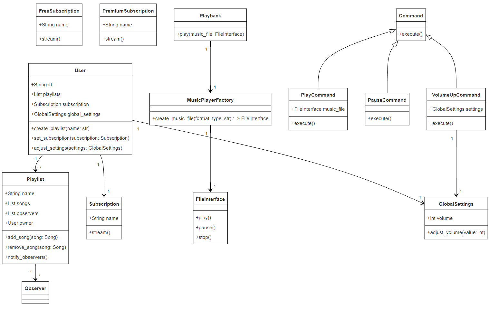

# 🎵 Musicer Architecture Document

## Overview

Musicer is designed as a modular music streaming application that demonstrates the use of various software design patterns. The architecture is centered around a clean separation of concerns, making it easy to maintain, extend, and test.

## Components

### 1. User

- **Description**: Represents the user of the Musicer application. Each user has unique attributes like playlists, subscription type, and global settings.
- **Attributes**:
  - `id`: Unique identifier for the user.
  - `playlists`: List of playlists created by the user.
  - `subscription`: Subscription type (e.g., Free, Premium).
  - `global_settings`: User-specific global settings (e.g., volume, theme).

### 2. Playlist

- **Description**: Manages songs and notifications. Each playlist is owned by a user and can notify observers about changes.
- **Attributes**:
  - `name`: The name of the playlist.
  - `songs`: List of songs in the playlist.
  - `observers`: List of observers (typically the owner).
- **Responsibilities**:
  - Notify observers when songs are added or removed.
  - Provide methods to add/remove songs.

### 3. Subscription

- **Description**: Abstract class defining different subscription types (Free and Premium).
- **Concrete Classes**:
  - `FreeSubscription`: Offers basic streaming with ads and lower quality.
  - `PremiumSubscription`: Provides ad-free and high-quality streaming.

### 4. Playback

- **Description**: Handles the playing of music files. It includes a factory for creating music file types.
- **Components**:
  - **MusicPlayerFactory**: Creates instances of music files based on the format.
  - **FileInterface**: An interface representing music file types like MP3, WAV, and FLAC.
- **Responsibilities**:
  - Manage playback controls (play, pause).
  - Interact with different file types to handle streaming.

### 5. Global Settings

- **Description**: Manages global settings for the application, such as volume and theme preferences.
- **Attributes**:
  - `volume`: Current volume level.
  - `theme`: Current theme of the application.
- **Responsibilities**:
  - Allow users to adjust settings that apply globally across the application.

### 6. Command

- **Description**: Implements the command pattern for encapsulating actions.
- **Concrete Classes**:
  - `PlayCommand`: Plays a specified music file.
  - `PauseCommand`: Pauses the current playback.
  - `VolumeUpCommand`: Increases the global volume.
- **Responsibilities**:
  - Define the methods to execute commands for playback and settings adjustments.

## Interaction Overview

The interaction between components is illustrated in the following table and diagram.

### Component Interaction Table

| Component       | Interacts With     | Description                                                                       |
| --------------- | ------------------ | --------------------------------------------------------------------------------- |
| User            | Playlist           | Users create, manage, and own playlists.                                          |
| User            | Subscription       | Each user selects a subscription type affecting streaming quality and experience. |
| User            | Global Settings    | Users manage global settings that affect the application's behavior and UI.       |
| Playlist        | User               | Notifies the user of changes in their playlists.                                  |
| Playback        | MusicPlayerFactory | Creates instances of different music file types for playback.                     |
| Playback        | Command            | Uses commands to control playback (e.g., play, pause).                            |
| Global Settings | Command            | Adjusts volume through commands (e.g., VolumeUpCommand).                          |
| Subscription    | User               | Determines streaming quality and behavior based on the user's subscription type.  |

### Component Interaction Diagram

Here's a visual representation of how these components interact with each other:

## Summary

The architecture of Musicer effectively utilizes design patterns to create a modular, maintainable, and extensible music streaming application. Each component has clearly defined responsibilities, allowing for easy modification and enhancement. The interaction between components facilitates a smooth user experience, with clear pathways for actions such as playlist management, subscription selection, and playback control.

---

This architecture document provides a comprehensive view of the system components, their roles, and their interactions, along with a visualization of the component relationships. This layout is suitable for stakeholders, developers, and maintainers to understand the overall structure and flow of the application.
